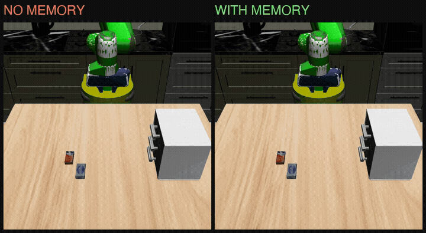
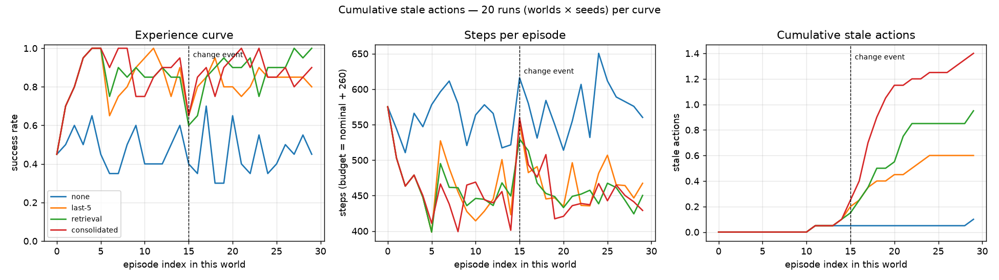

# The memory layer for robots

**A benchmark for cross-episode robot memory — does a robot learn from last week, and notice when a fact stops being true? — and the memory layer that passes it.** Built in public from zero robotics experience, starting 27 Aug 2026.

<p align="center"></p>
<p align="center"><em>Same kitchen, same task ("bring the pudding to the table"). Left: no memory, searches three drawers, 1003 steps. Right: remembers where it was, 361 steps.</em></p>

## The idea

Robot memory benchmarks test whether a policy remembers what happened *earlier in the same episode*. Deployment runs on a different question: does it remember *this drawer sticks*, *this box is heavy*, *the scissors live in the middle drawer* — and does it stop believing those things when they change?

So a world here is a **kitchen with secrets**: hidden, persistent properties no single task reveals for free. The robot does 30–50 tasks in it and can only learn the secrets by failing and remembering. Halfway through, the world quietly changes. **The score is the shape of the success curve across tasks**, plus how many actions were taken on beliefs that had stopped being true.

The benchmark ships a fixed, deliberately dumb planner. Entrants submit **only a memory module** behind two calls:

```python
memory.observe(episode)          # after each task
beliefs = memory.recall(task)    # before each task   (or recall_text() for an LLM/VLA prompt)
```

<p align="center"></p>
<p align="center"><em>MuJoCo/robosuite physics, 2,400 episodes: none 0.47 → last-5 0.83 → retrieval 0.86 → consolidated 0.86 AUC. Dashed line: the world changes.</em></p>

## What I've found so far

| # | finding | where |
|---|---|---|
| 1 | Any memory beats none by ~40 points within three tasks — abstract sim, physics, and with a language model reading the memory | log Days 4b, 10, 11 |
| 2 | A memory that never forgets is optimal while the world is static and the only kind that gets *worse* when it changes (LLM reader: 96% → 73%) | Days 7b, 11 |
| 3 | Failures are the information-dense episodes — with few options. With many, one confirming success outweighs any number of eliminations | Days 7c, 9c |
| 4 | Revision pays only when P(change) × cost(stale) > cost(probe). A success-only leaderboard rewards never revising; revision policy must be per fact type | Day 9e |
| 5 | Similarity retrieval loses to entity keys; interference only bites when entity count exceeds the memory's horizon | Days 9g, 9h |
| 6 | Physics teaches what abstraction cannot: close drawers behind you; handles above block lifts; a brushed wall against a sticky drawer breaks a light grip; fixed defaults leak information | Days 6, 9d |

Every number lives in [`docs/research-log.md`](docs/research-log.md), dated, with intervals — and with the bugs that produced the wrong numbers first. Leaderboard: [`docs/leaderboard.md`](docs/leaderboard.md).

## Run it

```bash
uv sync
uv run python -m bench.run                                   # four curves, abstract env, ~2 s
uv run python -m bench.evaluate --baselines                  # leaderboard
uv run python -m bench.evaluate --memory memlayer:MemoryLayer --name mine   # submit a memory
bash scripts/setup_rma_env.sh                                # physics env (macOS; Linux: setup_gpu_box.sh)
MUJOCO_GL=glfw vendor/rma-venv/bin/python -m bench.sim.run --properties sticky,heavy,location,fast --kinds put,put_any,fetch --calib-log outputs/sim_calibrate4.log
```

## Layout

| path | what |
|---|---|
| `bench/` | abstract env, worlds and hidden properties, planner, baselines, runners (`run`, `run_llm`, `run_x3`, `evaluate`, `headroom`) |
| `bench/sim/` | the same benchmark on robosuite/LIBERO physics |
| `memlayer/` | the library: SQLite fact store, per-fact-type revision policy, free-text `recall()`, stage-log ingestion + a RoboMemArena adapter |
| `scripts/` | RoboMemArena/openpi harness adapters, GPU-box setup, π₀.₅ fine-tuning pipeline (Phase 1) |
| `docs/` | roadmap, research log, benchmark design, library architecture, report draft, paper notes, posts, figures |

## Status and honesty

- Physics results separate memory from no memory cleanly; they do **not** separate raw retrieval from consolidated facts on success with the scripted planner — that gap shows in stale actions and with a language-model reader.
- The planner is scripted with privileged state and grasps are magnetic (documented). A fine-tuned π₀.₅ on RoboMemArena is in progress as the first learned policy.
- Simulation only so far; a small real-world replication (LeRobot SO-100, one kitchen world) is planned.

Posts and progress: [@Phillips-Ugo](https://github.com/Phillips-Ugo). Questions, disagreements, and memory modules welcome — open an issue.
