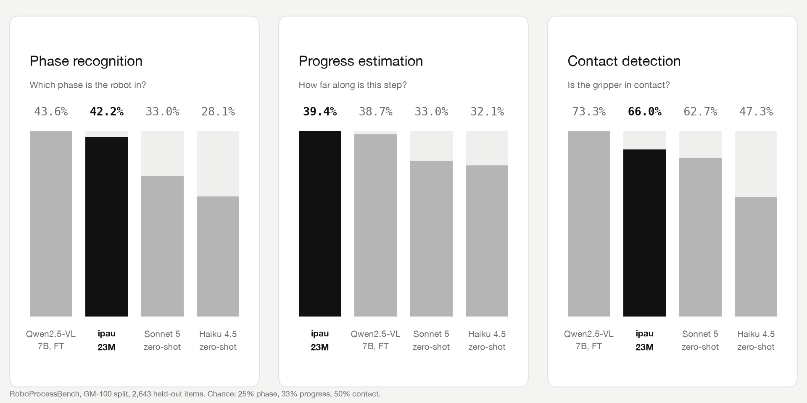
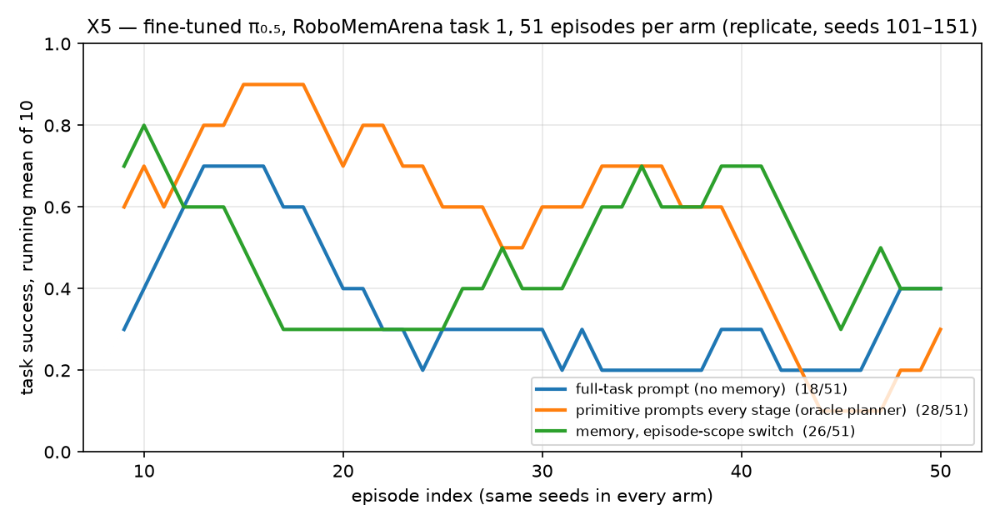

# Memory and judgment for robot policies

Two things, built in public from zero robotics experience since 27 Aug 2026:

1. **ipau** — a 23M-parameter *System-One judge* (Jev-style) that sits beside a VLA policy and answers typed questions about the robot's situation (which phase, is this subtask done, how far along) from camera frames in **7 ms**, with calibrated probabilities and no text generation.
2. **The memory layer** — a cross-episode memory benchmark ("kitchens with secrets": does the robot learn from last week, and notice when a fact stops being true?) and the library that passes it.

Technical note on the judge, with the architecture, every table and the repro commands: [`docs/site/index.html`](docs/site/index.html). Everything is dated and costed in [`docs/research-log.md`](docs/research-log.md).

<p align="center"></p>

## ipau — results so far

| what | result | where |
|---|---|---|
| In the loop with π₀.₅ (51 new episodes, one variable: who says a subtask is done) | judge **30/51** · simulator ground truth 25/51 · nothing 16/51; judge had 0 early fires, 1 miss | Day 16, `docs/results/x6_*` |
| RoboProcessBench, GM-100 split, same training/eval rows as the released baseline | phase 42.2 vs 43.6 (Qwen2.5-VL-7B fine-tuned), progress 39.4 vs 38.7; beats Claude Sonnet 5 / Haiku 4.5 zero-shot on both | Day 16, `docs/results/rpb_*` |
| Latency | 6.8 ms per decision (two views, RTX 6000 Ada); RoboMonitor (4B VLM) 180–200 ms; π₀.₅ ~100 ms per action chunk | Day 16 |
| Does the policy's own representation know? | π₀.₅ prefix features: stage-2 AUROC 0.74 vs 0.95 for the judge; benchmark 42.8 vs 45.6 overall → a separate judge is additive | Day 17 |

ipau = frozen DINOv2-S on agent + wrist views, a 3-frame window, 0.7M of trained heads; labels come free from the benchmark's stage checks on recorded rollouts. Design doc: [`docs/jev-robot-design.md`](docs/jev-robot-design.md); research briefs in [`docs/research/`](docs/research/).

## The memory layer — results so far

<p align="center"></p>

| # | finding | where |
|---|---|---|
| 1 | On a real VLA (π₀.₅ LoRA on RoboMemArena task 1), a one-fact memory lifts task success from 33/102 to 56/102 over two seed sets, reaching the oracle planner within 3–4 episodes; the per-stage variant *loses* to no memory — interventions must match the policy's training granularity | Days 13c–14, `docs/results/x5*` |
| 2 | A $5 LoRA of π₀.₅ scores 15/51 TSR on task 1 (paper baseline 20.0 % with a different recipe; stock checkpoint 0/51); every failure is stage 2 | Day 13 |
| 3 | In the benchmark: any memory beats none by ~40 points within three tasks; a memory that never forgets is the only kind that gets *worse* when the world changes (LLM reader 96 → 73 %) | Days 4b, 7b, 10, 11 |
| 4 | Revision pays only when P(change) × cost(stale) > cost(probe); entity-keyed retrieval beats similarity; failures are the information-dense episodes | Days 7c, 9e, 9g |

Entrants submit only a memory module behind two calls: `memory.observe(episode)` after each task, `memory.recall(task)` before. Leaderboard: [`docs/leaderboard.md`](docs/leaderboard.md).

## Run it

```bash
uv sync
# judge
uv run python -m jev.frames --every 10 --features dinov2_vits14            # stage labels + features from recordings
uv run python -m jev.train_head --features dinov2_vits14,dinov2_vits14_wrist --window 3
uv run python -m jev.rpb build && uv run python -m jev.rpb train             # RoboProcessBench (needs GM-100 videos)
# memory benchmark
uv run python -m bench.run                                                   # four curves, abstract env, ~2 s
uv run python -m bench.evaluate --memory memlayer:MemoryLayer --name mine    # submit a memory
# GPU runs (RunPod, driven from the laptop)
uv run python scripts/runpod_orchestrate.py check                            # provision + GPU check
bash scripts/x6_pod.sh                                                       # judge in the loop (see script header)
```

## Layout

| path | what |
|---|---|
| `jev/` | the judge: frame/label builders (`frames`, `demos`), heads (`train_head`, `export_head`), RoboProcessBench pipeline (`rpb`, `rpb_vlm`), π-feature comparison (`pi_compare`), charts |
| `memlayer/` | the library: SQLite fact store, per-fact-type revision policy, free-text `recall()`, stage-log ingestion, strategy memory (L5), RoboMemArena adapter |
| `bench/`, `bench/sim/` | the cross-episode benchmark in the abstract env and on robosuite/LIBERO physics |
| `scripts/` | harness adapters (`02` π₀.₅, `03` memory, `04` judge), π₀.₅ fine-tune pipeline, feature extraction, RunPod orchestration and pod scripts |
| `docs/` | research log, design docs, research briefs, results (`docs/results/`), figures, the technical-note site, posts |

## Status and honesty

- Judge: one task and one checkpoint in the loop; one benchmark source of four; frozen generic features; at chance on temporal ordering like every model on that benchmark; no calibration-aware training yet.
- Memory: simulation only; the within-episode stage signal is now the judge, the cross-episode strategy is the memory.
- Every table has raw results under `docs/results/`; wrong numbers and the bugs behind them stay in the log.

Jev is TypeSafe AI's model; this project borrows its framing and is not affiliated. Questions, disagreements, and memory modules welcome — open an issue.
